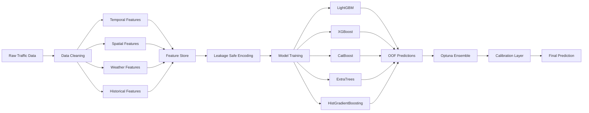

# Traffic Demand Prediction using Spatio-Temporal Intelligence and Ensemble Learning

## Executive Summary

Traffic demand forecasting is a critical component of modern intelligent transportation systems, enabling efficient fleet management, congestion mitigation, route optimization, and urban mobility planning. The objective of this project is to accurately predict future traffic demand by leveraging temporal, spatial, environmental, and historical traffic information.

The proposed solution adopts a feature-centric machine learning approach that combines advanced feature engineering, leakage-safe encoding strategies, geospatial intelligence, historical demand modeling, and ensemble learning techniques. Rather than relying on a single predictive model, multiple complementary learners are trained and combined through an optimized weighting framework to maximize predictive performance and generalization capability.

The final framework integrates:

- Temporal Intelligence
- Spatial Intelligence
- Historical Demand Memory
- Leakage-Safe Learning
- Ensemble Optimization
- Prediction Calibration

to produce a robust and scalable traffic forecasting system.

---

## Problem Statement

Traffic demand forecasting is inherently challenging due to the presence of:

- Strong temporal seasonality
- Geographic heterogeneity
- Nonlinear demand fluctuations
- Demand volatility
- Weather-related influences
- Complex interactions between spatial and temporal variables

Traditional forecasting approaches frequently struggle to capture all these factors simultaneously.

The objective of this project is therefore to develop a machine learning framework capable of learning complex nonlinear relationships between spatial, temporal, environmental, and historical traffic variables while maintaining strong generalization performance.

---

## Project Objectives

The primary objectives of this project are:

- Capture cyclic traffic patterns across multiple time scales.
- Learn regional traffic behaviour using geospatial information.
- Exploit historical demand dependencies.
- Prevent target leakage during feature generation.
- Improve robustness through model diversity.
- Maximize predictive accuracy using ensemble learning.
- Align prediction distributions using calibration techniques.

---

## Methodology

The proposed framework follows a multi-stage forecasting pipeline designed to capture temporal, spatial, environmental, and historical traffic patterns while minimizing overfitting and target leakage.

The entire solution is organized around five key principles:

1. Spatio-Temporal Representation Learning
2. Historical Demand Memory
3. Leakage-Safe Feature Engineering
4. Ensemble Learning
5. Distribution-Aware Calibration

Instead of relying solely on model complexity, the framework emphasizes rich feature generation and robust validation strategies.

---

## Design Philosophy

The central hypothesis behind the solution is that traffic demand is driven by interactions between multiple independent processes:

- Daily commuting cycles
- Weekly behavioral cycles
- Geographical traffic zones
- Weather conditions
- Road-network characteristics
- Historical traffic memory

No single model is expected to capture all such dynamics effectively.

Consequently, the solution focuses on constructing high-quality representations of the underlying traffic system and combining multiple machine learning models to capture diverse aspects of demand behavior.

---

## System Architecture

---

## Stage 1: Data Representation

The original dataset contains heterogeneous information sources that capture different aspects of traffic behavior.

| Data Source | Information Captured |
|------------|----------------------|
| Timestamp | Temporal behavior |
| Geohash | Spatial information |
| Weather Features | Environmental conditions |
| Road Information | Infrastructure characteristics |
| Historical Demand | Temporal memory |

Rather than using raw variables directly, the framework transforms each source into machine-learning-friendly representations.

---

## Stage 2: Feature Engineering

Feature engineering constitutes the most important component of the forecasting pipeline. The objective is to transform raw observations into representations that expose latent temporal, spatial, and historical traffic dynamics.

The generated features can be broadly categorized into temporal, spatial, and historical representations.

---

### Temporal Features

Traffic demand exhibits strong cyclical behavior across multiple time horizons, including hourly, daily, and weekly patterns. A direct numerical representation of time is often inadequate because cyclical variables possess periodic continuity. For example, 23:00 and 00:00 are temporally adjacent despite being numerically distant.

To preserve cyclic relationships, Fourier harmonic encodings are employed.

For a periodic signal with period \(P\), the \(k\)-th harmonic representation is defined as

$$
\phi_{\sin}^{(k)}(t) = \sin\!\left(\frac{2\pi k t}{P}\right), \quad k = 1,2,3,\dots
$$

$$
\phi_{\cos}^{(k)}(t) = \cos\!\left(\frac{2\pi k t}{P}\right)$$

## Temporal Features

Traffic demand exhibits strong periodic patterns. To capture these cycles, harmonic encodings are used:

$$
\phi_{\sin}^{(k)}(t) = \sin\!\left(\frac{2\pi k t}{P}\right), \quad k = 1,2,3,\dots
$$

$$
\phi_{\cos}^{(k)}(t) = \cos\!\left(\frac{2\pi k t}{P}\right)
$$

where:

| Symbol | Description |
|--------|-------------|
| $$\(t\)$$ | Temporal index |
| $$\(P\)$$ | Length of the cycle period |
| $$\(k\)$$ | Harmonic order |
| $$\(\phi_{\sin}^{(k)}\)$$ | Sine harmonic encoding |
| $$\(\phi_{\cos}^{(k)}\)$$ | Cosine harmonic encoding |

The resulting feature space preserves periodic continuity and enables the model to learn recurring traffic patterns more effectively than conventional timestamp representations.

Examples include:

$$
Hour_{\sin} = \sin\!\left(\frac{2\pi \cdot Hour}{24}\right)
$$

$$
Hour_{\cos} = \cos\!\left(\frac{2\pi \cdot Hour}{24}\right)
$$

$$
DayOfWeek_{\sin} = \sin\!\left(\frac{2\pi \cdot DayOfWeek}{7}\right)
$$

$$
DayOfWeek_{\cos} = \cos\!\left(\frac{2\pi \cdot DayOfWeek}{7}\right)
$$

---

### Spatial Features

Traffic demand is strongly influenced by geographic location. Urban centers, residential regions, industrial zones, and transportation corridors often exhibit significantly different traffic patterns.

To capture these spatial dependencies, geohashes are first decoded into latitude-longitude coordinates

$$
g_i \longrightarrow (lat_i, lon_i)
$$

where \(g_i\) denotes the geospatial identifier associated with observation \(i\).

Subsequently, K-Means clustering is employed to identify regions exhibiting similar traffic behavior.

The clustering objective is formulated as

$$
\min_{\{\mathbf{c}_k\}_{k=1}^{K}} \sum_{i=1}^{N} \min_{k} \left\| \mathbf{x}_i - \mathbf{c}_k \right\|_2^2
$$

where

| Symbol | Description |
|--------|-------------|
| $$\(N\)$$ | Number of observations |
| $$\(K\)$$ | Number of clusters |
| $$\(\mathbf{x}_i\)$$ | Spatial coordinate vector |
| $$\(\mathbf{c}_k\)$$ | Cluster centroid |
| $$\(\|\cdot\|_2\)$$ | Euclidean distance |

The resulting cluster assignments serve as region-level traffic descriptors and enable the forecasting models to learn location-specific demand patterns.

---

### Historical Demand Features

Traffic demand exhibits significant temporal autocorrelation. Future traffic levels are frequently influenced by recent demand observations as well as longer-term seasonal trends.

To capture this temporal memory, lag-based and rolling statistical features are generated.

A lag feature with offset \(h\) is defined as

$$
Lag_t^{(h)} = y_{t-h}
$$

where

| Symbol | Description |
|--------|-------------|
| $$\(y_t\)$$ | Traffic demand at time $$\(t\)$$ |
| $$\(h\)$$ | Lag horizon |
| $$\(Lag_t^{(h)}\)$$ | Historical demand observation |

Examples include

$$
Lag_t^{(24)} = y_{t-24}
$$

$$
Lag_t^{(168)} = y_{t-168}
$$

which capture daily and weekly seasonality respectively.

To characterize local trends, rolling mean features are computed as

$$
RM_t^{(w)} = \frac{1}{w} \sum_{i=1}^{w} y_{t-i}
$$

where $$\(w\)$$ denotes the rolling window size.

Demand volatility is represented through rolling variance

$$
RV_t^{(w)} = \frac{1}{w} \sum_{i=1}^{w} \left( y_{t-i} - RM_t^{(w)} \right)^2
$$

and rolling standard deviation

$$
RSD_t^{(w)} = \sqrt{RV_t^{(w)}}
$$

Together, these features provide the model with information regarding demand momentum, local trends, and traffic volatility.

---

## Stage 3: Leakage-Safe Target Encoding

Many categorical variables possess high cardinality and cannot be represented effectively using conventional one-hot encoding.

To address this challenge, smoothed target encoding is employed.

For a category $$\(c\)$$, the encoded representation is defined as

$$
TE(c) = \frac{n_c \mu_c + \alpha \mu_g}{n_c + \alpha}
$$

where

| Symbol | Description |
|--------|-------------|
| $$\(n_c\)$$ | Number of observations in category $$\(c\)$$ |
| $$\(\mu_c\)$$ | Mean target value of category $$\(c\)$$ |
| $$\(\mu_g\)$$ | Global target mean |
| $$\(\alpha\)$$ | Smoothing coefficient |

The smoothing parameter prevents overfitting for rare categories by shrinking category statistics toward the global mean.

To eliminate target leakage, target encoding is computed exclusively within cross-validation folds.

---

## Stage 4: Model Development

Multiple gradient-boosting and tree-based learners are trained independently.

The prediction of a boosting ensemble can be represented as

$$
\hat{y}_i = \sum_{m=1}^{M} \eta \, h_m(\mathbf{x}_i)
$$

where

| Symbol | Description |
|--------|-------------|
| $$\(\hat y_i\)$$ | Predicted demand |
| $$\(M\)$$ | Number of boosting rounds |
| $$\(\eta\)$$ | Learning rate |
| $$\(h_m(\cdot)\)$$ | Decision tree at iteration \(m\) |
| $$\(\mathbf{x}_i\)$$ | Feature vector |

This additive formulation allows the model to iteratively reduce prediction error while capturing complex nonlinear interactions among traffic features.

---

## Stage 5: Ensemble Optimization

The final prediction is generated through weighted model aggregation.

Given $$\(K\)$$ base learners, the ensemble prediction is defined as

$$
\hat{y}_i^{ensemble} = \sum_{j=1}^{K} w_j \hat{y}_i^{(j)}
$$

subject to

$$
\sum_{j=1}^{K} w_j = 1
$$

and

$$
w_j \ge 0, \qquad j=1,\ldots,K.
$$

Here,

| Symbol | Description |
|--------|-------------|
| $$\(w_j\)$$ | Weight assigned to model $$\(j\)$$ |
| $$\(\hat y_i^{(j)}\)$$ | Prediction from model $$\(j\)$$ |
| $$\(K\)$$ | Number of base learners |

The optimal weight vector is obtained through Bayesian optimization using Optuna.

---

## Stage 6: Prediction Calibration

Although ensemble models achieve high predictive accuracy, the distribution of predictions may deviate slightly from the true target distribution.

To correct this discrepancy, a calibration factor is introduced

$$
CF = \frac{\mu_{\text{expected}}}{\mu_{\text{OOF}}}
$$

where

- $$\(\mu_{\text{expected}}\)$$ denotes the expected target mean,
- $$\(\mu_{\text{OOF}}\)$$ denotes the mean out-of-fold prediction.

The calibrated prediction is computed as

$$
\hat{y}_i^{\text{cal}} = \text{clip}\left( \hat{y}_i^{\text{ensemble}} \times CF \times 1.01, \; 0, \; 1 \right)
$$

where $\text{clip}(x, \text{min}, \text{max}) = \max(\min(x, \text{max}), \text{min})$.

ensuring that predictions remain within the valid target range.

---

## Evaluation Metric

Model performance is evaluated using the coefficient of determination \(R^2\)

$$
R^2 = 1 - \frac{ \sum_{i=1}^{N} \left( y_i - \hat y_i \right)^2 }{ \sum_{i=1}^{N} \left( y_i - \bar y \right)^2 }
$$

where

$$
\bar y = \frac{1}{N} \sum_{i=1}^{N} y_i
$$

denotes the sample mean of the target variable.

An $$\(R^2\)$$ value closer to 1 indicates superior predictive performance and stronger explanatory power of the forecasting model.

## Experimental Results

### Model Performance

| Model | Mean R² |
|---------|---------|
| LightGBM Base | 0.963 |
| LightGBM Aggressive | 0.963 |
| LightGBM Alternative | 0.963 |
| ExtraTrees | 0.633 |
| XGBoost | 0.588 |
| LightGBM Light | 0.540 |
| LightGBM Very Light | 0.530 |
| HistGradientBoosting | 0.445 |
| CatBoost | 0.139 |

---

## Key Findings

- Temporal harmonic encodings effectively captured cyclic traffic dynamics.
- Historical demand features emerged as the strongest predictive signals.
- Spatial clustering improved regional traffic representation.
- Leakage-safe encoding improved generalization performance.
- Ensemble learning significantly reduced prediction variance.
- Calibration improved alignment between predicted and observed distributions.
- LightGBM-based models consistently delivered superior performance.

---

## Business Impact

The framework can be applied to:

- Smart city traffic management
- Ride-sharing demand forecasting
- Fleet allocation systems
- Logistics optimization
- Dynamic route planning
- Congestion mitigation systems
- Urban transportation analytics

---

## Future Work

Potential future improvements include:

- Graph Neural Networks for road-network modeling.
- Temporal Fusion Transformers.
- Deep Spatio-Temporal Learning.
- Real-time traffic forecasting pipelines.
- Reinforcement Learning for adaptive traffic management.
- Physics-informed transportation modeling.

---

## Conclusion

This project demonstrates how spatio-temporal intelligence, historical demand memory, ensemble learning, and calibration techniques can be integrated into a unified forecasting framework. The resulting solution achieves strong predictive performance while remaining scalable, interpretable, and deployable in real-world transportation systems.

---

## Author

Rithanya Raj & Anjan Mahapatra
