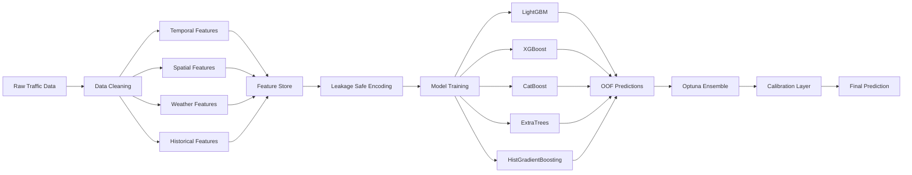

# Traffic Demand Prediction using Spatio-Temporal Intelligence and Ensemble Learning

## Executive Summary

Traffic demand forecasting is a critical component of modern intelligent transportation systems, enabling efficient fleet management, congestion mitigation, route optimization, and urban mobility planning. The objective of this project is to accurately predict future traffic demand by leveraging temporal, spatial, environmental, and historical traffic information.

The proposed solution adopts a feature-centric machine learning approach that combines advanced feature engineering, leakage-safe encoding strategies, geospatial intelligence, historical demand modeling, and ensemble learning techniques. Rather than relying on a single predictive model, multiple complementary learners are trained and combined through an optimized weighting framework to maximize predictive performance and generalization capability.

The final framework integrates:

- Temporal Intelligence
- Spatial Intelligence
- Historical Demand Memory
- Leakage-Safe Learning
- Ensemble Optimization
- Prediction Calibration

to produce a robust and scalable traffic forecasting system.

---

## Problem Statement

Traffic demand forecasting is inherently challenging due to the presence of:

- Strong temporal seasonality
- Geographic heterogeneity
- Nonlinear demand fluctuations
- Demand volatility
- Weather-related influences
- Complex interactions between spatial and temporal variables

Traditional forecasting approaches frequently struggle to capture all these factors simultaneously.

The objective of this project is therefore to develop a machine learning framework capable of learning complex nonlinear relationships between spatial, temporal, environmental, and historical traffic variables while maintaining strong generalization performance.

---

## Project Objectives

The primary objectives of this project are:

- Capture cyclic traffic patterns across multiple time scales.
- Learn regional traffic behaviour using geospatial information.
- Exploit historical demand dependencies.
- Prevent target leakage during feature generation.
- Improve robustness through model diversity.
- Maximize predictive accuracy using ensemble learning.
- Align prediction distributions using calibration techniques.

---

## Methodology

The proposed framework follows a multi-stage forecasting pipeline designed to capture temporal, spatial, environmental, and historical traffic patterns while minimizing overfitting and target leakage.

The entire solution is organized around five key principles:

1. Spatio-Temporal Representation Learning
2. Historical Demand Memory
3. Leakage-Safe Feature Engineering
4. Ensemble Learning
5. Distribution-Aware Calibration

Instead of relying solely on model complexity, the framework emphasizes rich feature generation and robust validation strategies.

---

## Design Philosophy

The central hypothesis behind the solution is that traffic demand is driven by interactions between multiple independent processes:

- Daily commuting cycles
- Weekly behavioral cycles
- Geographical traffic zones
- Weather conditions
- Road-network characteristics
- Historical traffic memory

No single model is expected to capture all such dynamics effectively.

Consequently, the solution focuses on constructing high-quality representations of the underlying traffic system and combining multiple machine learning models to capture diverse aspects of demand behavior.

---

## System Architecture

---

## Stage 1: Data Representation

The original dataset contains heterogeneous information sources that capture different aspects of traffic behavior.

| Data Source | Information Captured |
|------------|----------------------|
| Timestamp | Temporal behavior |
| Geohash | Spatial information |
| Weather Features | Environmental conditions |
| Road Information | Infrastructure characteristics |
| Historical Demand | Temporal memory |

Rather than using raw variables directly, the framework transforms each source into machine-learning-friendly representations.

---

## Stage 2: Feature Engineering

Feature engineering forms the foundation of the entire solution.

Three major feature groups are generated:

### Temporal Features

Temporal features capture recurring traffic patterns such as:

- Hourly seasonality
- Daily seasonality
- Weekly seasonality
- Monthly patterns

To preserve cyclic continuity, Fourier harmonic encodings are used instead of raw timestamps.

For a cycle period \(P\),

$$
\phi_{\sin}^{(k)}
=
\sin
\left(
\frac{2\pi kt}{P}
\right)
$$

$$
\phi_{\cos}^{(k)}
=
\cos
\left(
\frac{2\pi kt}{P}
\right)
$$

This representation allows the model to learn periodic demand behaviour more effectively.

### Spatial Features

Traffic demand varies significantly across geographic regions.

Geohashes are decoded into latitude-longitude coordinates and clustered using K-Means.

$$
\underset{\{\mathbf{c}_k\}_{k=1}^{K}}
{\operatorname{argmin}}
\sum_{i=1}^{N}
\min_k
\left\|
\mathbf{x}_i-\mathbf{c}_k
\right\|_2^2
$$

The resulting clusters help identify regions exhibiting similar traffic characteristics.

### Historical Demand Features

Traffic demand exhibits strong autocorrelation.

Historical memory is incorporated through:

| Feature Type | Purpose |
|-------------|----------|
| Lag Features | Previous demand information |
| Rolling Mean | Trend estimation |
| Rolling Variance | Volatility estimation |
| Rolling Standard Deviation | Demand stability |

Examples:

$$
Lag_t^{(24)}
=
y_{t-24}
$$

$$
Lag_t^{(168)}
=
y_{t-168}
$$

---

## Stage 3: Leakage-Safe Target Encoding

High-cardinality categorical features are encoded using smoothed target encoding.

$$
TE(c)
=
\frac{
n_c\mu_c
+
\alpha\mu_g
}{
n_c+\alpha
}
$$

where:

| Symbol | Description |
|----------|----------|
| \(n_c\) | Category frequency |
| \(\mu_c\) | Category mean |
| \(\mu_g\) | Global mean |
| \(\alpha\) | Smoothing parameter |

Cross-validation-based encoding is used to eliminate target leakage.

---

## Stage 4: Model Development

Multiple tree-based learners are trained independently.

| Model | Purpose |
|---------|---------|
| LightGBM Base | Primary learner |
| LightGBM Aggressive | High-capacity learner |
| LightGBM Alternative | Diversity learner |
| XGBoost | Gradient boosting benchmark |
| CatBoost | Categorical feature learner |
| ExtraTrees | Variance reduction |
| HistGradientBoosting | Histogram optimization |

The prediction of a boosting model can be expressed as:

$$
\hat y_i
=
\sum_{m=1}^{M}
\eta h_m(\mathbf{x}_i)
$$

where \(h_m\) denotes the \(m\)-th decision tree.

---

## Stage 5: Ensemble Optimization

Predictions from all base learners are combined using weighted averaging.

The ensemble prediction is:

$$
\hat y_i^{ensemble}
=
\sum_{j=1}^{K}
w_j
\hat y_i^{(j)}
$$

subject to:

$$
\sum_{j=1}^{K}
w_j
=
1
$$

and

$$
w_j \ge 0
$$

Optuna is used to determine the optimal weights that maximize validation performance.

---

## Stage 6: Prediction Calibration

Even highly accurate models may produce predictions whose statistical distribution differs slightly from the target distribution.

To address this issue, a calibration layer is introduced.

$$
CF
=
\frac{
\mu_{expected}
}{
\mu_{OOF}
}
$$

The final prediction becomes:

$$
\hat y_i^{cal}
=
\operatorname{clip}
\left(
\hat y_i^{ensemble}
\times CF
\times 1.01,
0,
1
\right)
$$

---

## Evaluation Metric

The coefficient of determination is used as the primary evaluation metric.

$$
R^2
=
1
-
\frac{
\sum_{i=1}^{N}
(y_i-\hat y_i)^2
}{
\sum_{i=1}^{N}
(y_i-\bar y)^2
}
$$

---

## Experimental Results

### Model Performance

| Model | Mean R² |
|---------|---------|
| LightGBM Base | 0.963 |
| LightGBM Aggressive | 0.963 |
| LightGBM Alternative | 0.963 |
| ExtraTrees | 0.633 |
| XGBoost | 0.588 |
| LightGBM Light | 0.540 |
| LightGBM Very Light | 0.530 |
| HistGradientBoosting | 0.445 |
| CatBoost | 0.139 |

---

## Key Findings

- Temporal harmonic encodings effectively captured cyclic traffic dynamics.
- Historical demand features emerged as the strongest predictive signals.
- Spatial clustering improved regional traffic representation.
- Leakage-safe encoding improved generalization performance.
- Ensemble learning significantly reduced prediction variance.
- Calibration improved alignment between predicted and observed distributions.
- LightGBM-based models consistently delivered superior performance.

---

## Business Impact

The framework can be applied to:

- Smart city traffic management
- Ride-sharing demand forecasting
- Fleet allocation systems
- Logistics optimization
- Dynamic route planning
- Congestion mitigation systems
- Urban transportation analytics

---

## Future Work

Potential future improvements include:

- Graph Neural Networks for road-network modeling.
- Temporal Fusion Transformers.
- Deep Spatio-Temporal Learning.
- Real-time traffic forecasting pipelines.
- Reinforcement Learning for adaptive traffic management.
- Physics-informed transportation modeling.

---

## Conclusion

This project demonstrates how spatio-temporal intelligence, historical demand memory, ensemble learning, and calibration techniques can be integrated into a unified forecasting framework. The resulting solution achieves strong predictive performance while remaining scalable, interpretable, and deployable in real-world transportation systems.
